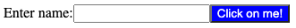
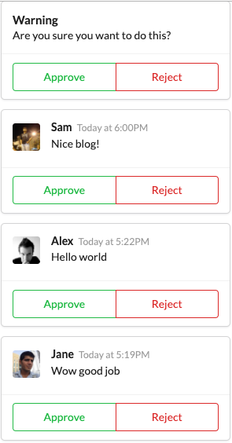
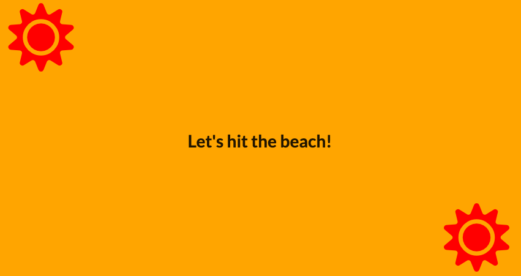

# Learning React
Udemy: Modern React with Redux [2020 Update]

## JSX
A very simple example to introduce react and JSX. 
 

## Components
This projects shows an example of hardcoded blog comments that are made using react components. 
 

## Seasons
This projects simply gets your browser's location and displays a cute image based on the location's season. This has a great example of how to do a loading screen. 
 
